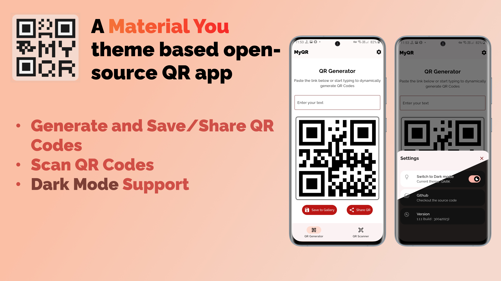
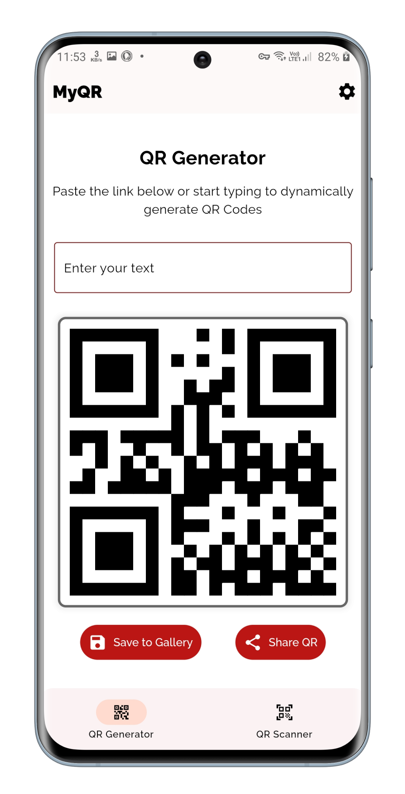
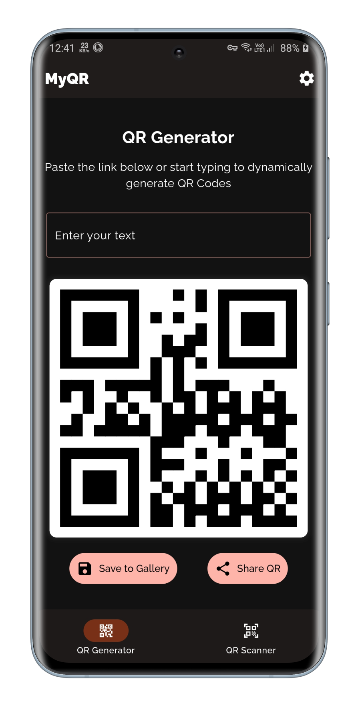
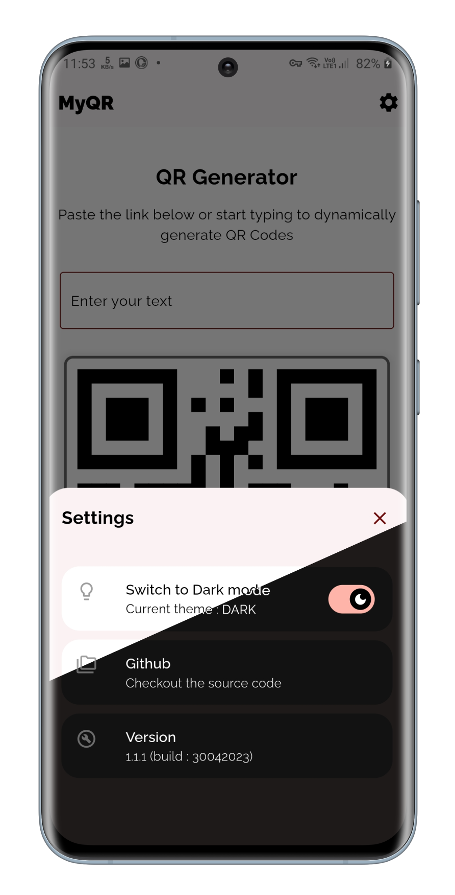

# **MyQR**

MyQR, a Material You themed Flutter app to Create, Save, Scan QR codes.

 
  

## **Download Now**

---

## Manage QR Code

- Generate QR Codes
- Save or Share QR Codes
- QR Code Scanner
- Material You theming
- Dark Mode support

---

## Mockups

|  |  |  |
| :--: | :--: | :--: |
| Home (Light Mode) | Home (Dark Mode) | Settings |

---

### License

    Copyright (c) 2023, Sanketh Jain
    All rights reserved.
    
    This source code is licensed under the GPLv3-style license found in the
    LICENSE file in the root directory of this source tree.
